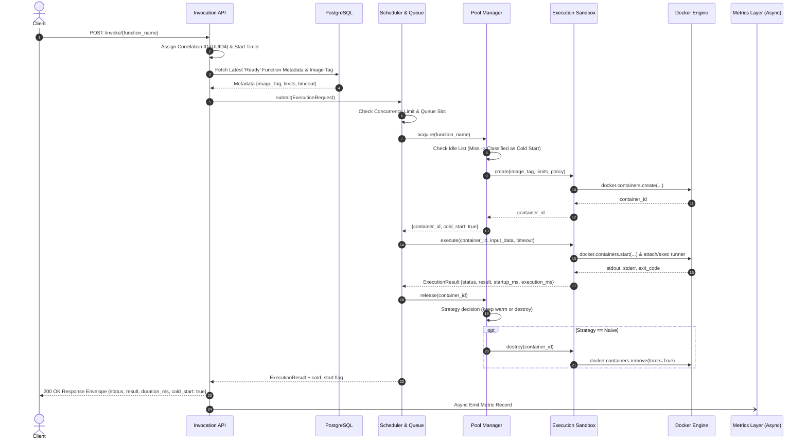
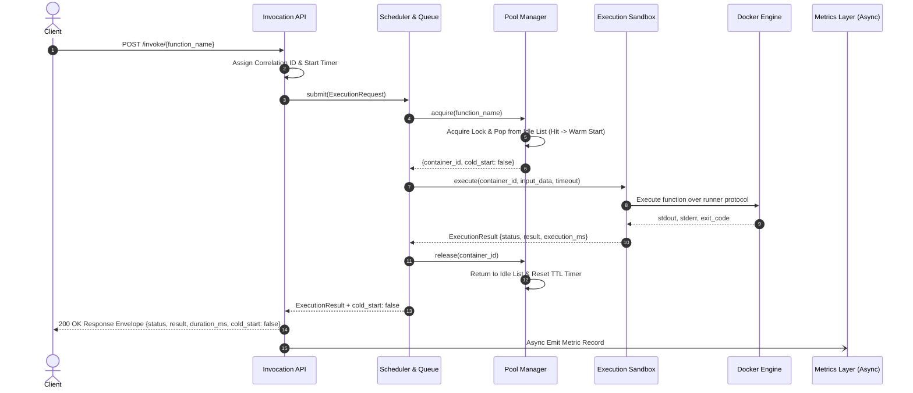
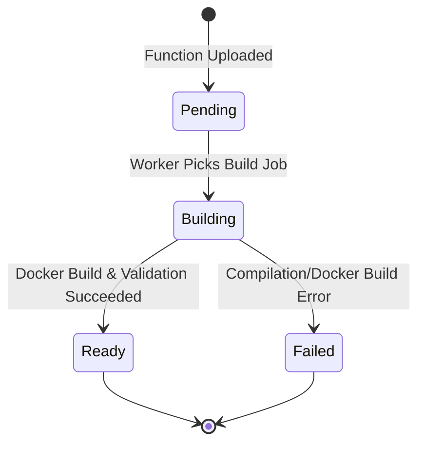
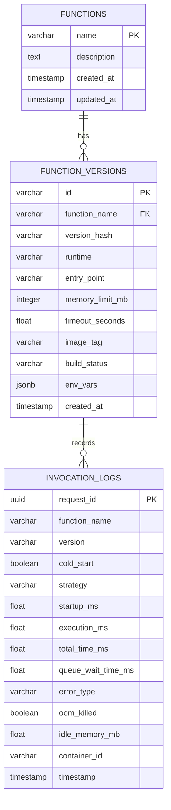
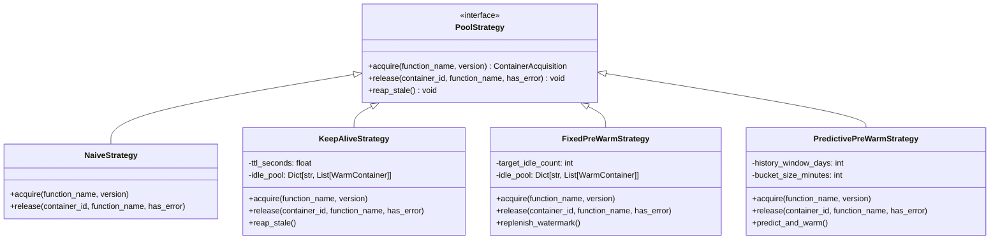

# PodLaunch: System Architecture Specification

This document defines the architectural blueprints, component boundaries, execution lifecycles, shared contracts, data models, error taxonomies, and concurrency models for **PodLaunch**.

---

## 1. System Architecture Overview

PodLaunch adopts a modular, decoupled architecture where each component is independently testable via well-defined contracts and stubs.

```mermaid
graph TB
    subgraph Ingress ["1. API & Registry Layer"]
        Client["Client / Load Generator"] -->|HTTP POST /invoke| API["Invocation API (FastAPI)"]
        User["Developer"] -->|HTTP POST /functions/build| Registry["Function Registry"]
        Registry -->|Write Metadata| DB[("PostgreSQL")]
        Registry -->|Build Image via Docker-py| DockerEngine[("Docker Engine")]
    end

    subgraph Orchestration ["2. Scheduling & Concurrency"]
        API -->|ExecutionRequest| Scheduler["Scheduler & Queue"]
        Scheduler -->|Query Limits / Status| DB
    end

    subgraph ResourcePooling ["3. Container Pool Manager (Research Core)"]
        Scheduler -->|acquire(function_name)| PoolManager["Pool Manager"]
        PoolManager -->|release(container)| PoolManager
        PoolManager -->|Select Strategy| StratEngine{"Strategy Engine"}
        StratEngine -->|1| StratNaive["Naive Strategy"]
        StratEngine -->|2| StratKeepAlive["Keep-Alive Strategy"]
        StratEngine -->|3| StratFixed["Fixed Pre-Warm"]
        StratEngine -->|4| StratPredictive["Predictive Pre-Warm"]
    end

    subgraph ExecutionLayer ["4. Execution Sandbox"]
        PoolManager -->|create / execute / destroy| Sandbox["Execution Sandbox"]
        Sandbox -->|Run in cgroups/namespaces| ContainerInstance[("Function Container")]
    end

    subgraph TelemetryLayer ["5. Metrics & Dashboard"]
        API -.->|Async Event| MetricsLogger["Metrics Collector"]
        Scheduler -.->|Async Event| MetricsLogger
        Sandbox -.->|Async Event| MetricsLogger
        MetricsLogger -->|Store Telemetry| DB
        DB -->|Query Percentiles & History| Dashboard["React Dashboard"]
    end
```

---

## 2. Request Lifecycles & Sequence Diagrams

### 2.1 Cold-Start Invocation Sequence
A cold start occurs when no warm container is present in the idle pool for the requested function.



---

### 2.2 Warm-Start Invocation Sequence
A warm start occurs when a pre-existing idle container is immediately reused from the pool.



---

## 3. Component Boundaries & Responsibilities

```
+-------------------------------------------------------------------------------+
|                             COMPONENT MATRIX                                  |
+-----------------------------------+-------------------+-----------------------+
| Component                         | Owner             | Primary Responsibility|
+-----------------------------------+-------------------+-----------------------+
| 1. Function Registry & API        | Aman Pal          | Intake, build & HTTP  |
| 2. Scheduler & Queue              | Aryan Arora       | Concurrency & dispatch|
| 3. Container Pool Manager         | Tanishk Tiwari    | Pooling & cold metrics|
| 4. Execution Sandbox              | Harsh Aggarwal    | Docker isolation      |
| 5. Metrics & Benchmarking         | Rhythm Dhangar    | Workloads & telemetry |
| 6. Dashboard (Frontend)           | Rhythm Dhangar    | Telemetry visualization|
+-----------------------------------+-------------------+-----------------------+
```

### 3.1 Function Registry & Invocation API (Owner: Aman Pal)
- **Responsibilities:**
  - Ingest function packages (`zip`/directory) and configuration files (`runtime: python3.11 | node18`, `entry_point`, `memory_limit`, `timeout`, `env_vars`).
  - Pre-build validation: verifies entry points, runtime support, and resource limit bounds.
  - Multi-stage image packaging via `docker-py` with distinct dependency caching layers.
  - Compute SHA-256 hash of code + config to enforce immutable content-based versioning.
  - Maintain function and version metadata in PostgreSQL as the single source of truth.
  - Expose FastAPI endpoints: `POST /invoke/{function_name}` and optional `POST /invoke/{function_name}/{version}` (defaults to latest `Ready` version).
  - Generate UUID4 correlation ID at ingress and wrap all output in the standard response envelope.
- **Inputs:** Raw code bundle, runtime configs, HTTP client invocation requests.
- **Outputs:** Docker images tagged in local daemon, PostgreSQL metadata rows, HTTP response envelopes.
- **MUST NOT:**
  - Execute function code directly.
  - Manage container lifecycles or hold container references.
  - Make scheduling or pooling policy decisions.

#### Build Pipeline State Machine


---

### 3.2 Scheduler & Queue (Owner: Aryan Arora)
- **Responsibilities:**
  - In-memory `asyncio.Queue` FIFO queue for incoming execution requests.
  - Enforce per-function concurrency limits before dispatching to the pool.
  - Bounded queue capacity with deterministic error handling when full.
  - Oversee execution timeouts and reclaim concurrency slots upon completion or failure.
  - Route execution requests to the Pool Manager and hand off obtained containers to the Sandbox.
- **Inputs:** `ExecutionRequest` from API layer.
- **Outputs:** Dispatched tasks to Pool Manager / Sandbox, error returns (429/504) upon saturation or timeout.
- **MUST NOT:**
  - Decide container lifecycles, TTLs, or pooling replenishment strategies.
  - Directly invoke Docker Engine APIs (must interact through Sandbox/Pool abstractions).

---

### 3.3 Container Pool Manager — *Research Core* (Owner: Tanishk Tiwari)
- **Responsibilities:**
  - Expose an explicit two-method interface: `acquire(function_name)` and `release(container_id)`.
  - Maintain the inventory of active, idle, and initializing containers per function.
  - Provide the definitive classification of `cold_start: true | false` for every invocation.
  - Implement and encapsulate four pooling strategies:
    1. **Naive:** No reuse; create on acquire, destroy on release.
    2. **Keep-Alive:** Idle TTL timer; background reaper destroys containers inactive past threshold.
    3. **Fixed Pre-Warm:** Watermark replenishment maintaining $N$ idle containers at all times.
    4. **Predictive Pre-Warm:** Moving average time-bucket pre-warming driven by PostgreSQL invocation history.
  - Enforce strict concurrency locks over per-function idle lists to prevent race conditions (double hand-outs).
  - Background reaper for safety cleanup (destroying containers exceeding hard maximum lifespan).
- **Inputs:** Function identifier/image reference from Scheduler.
- **Outputs:** Allocated container identifier, warm/cold classification flag.
- **MUST NOT:**
  - Manage HTTP request/response formatting.
  - Parse user payload input/output data.
  - Directly execute user code inside containers.

---

### 3.4 Execution Sandbox (Owner: Harsh Aggarwal)
- **Responsibilities:**
  - Encapsulate all direct interactions with the Docker Engine daemon (`docker-py`).
  - Implement the three-stage lifecycle interface: `create()`, `execute()`, and `destroy()`.
  - Enforce strict security and isolation boundaries:
    - Default memory ceiling: 128 MB (cgroup limit).
    - CPU quota: 0.5 vCPU.
    - Process limit: PID limit = 64.
    - Network isolation: bridge/none (network disabled by default).
    - Unprivileged execution: non-root user, no capability additions, no host filesystem mounts.
    - Zero Docker socket exposure: never bind `/var/run/docker.sock`.
  - Capture stdout and stderr independently; record detailed timing diagnostics (`startup_ms`, `execution_ms`, `total_time_ms`).
  - Classify execution results into the platform error taxonomy.
- **Inputs:** Container image tag, resource parameters, execution payload, timeout limits.
- **Outputs:** `ExecutionResult` struct containing exit status, payload output, error taxonomy enum, and timing breakdown.
- **MUST NOT:**
  - Store or decide pooling strategies, TTLs, or pre-warm counts.
  - Maintain persistent queue state.

---

### 3.5 Metrics, Benchmarking & Workload Generator (Owner: Rhythm Dhangar)
- **Responsibilities:**
  - Define unified telemetry schema across all components.
  - Collect telemetry asynchronously off the request hot path.
  - Provide a deterministic, seeded workload generator supporting:
    - **Bursty:** Poisson arrivals with controllable burst multipliers.
    - **Steady:** Fixed inter-arrival intervals.
    - **Periodic:** Cron-like scheduled invocation pulses.
  - Benchmark harness running identical traffic profiles against all 4 strategies, plus OpenFaaS and Knative.
  - Compute streaming percentiles (p50, p90, p99) and resource efficiency ratios (idle memory overhead vs cold-start reduction).
- **Inputs:** Asynchronous event logs from API, Scheduler, Sandbox, and Pool Manager.
- **Outputs:** Telemetry rows in PostgreSQL, Prometheus-formatted counters/gauges, benchmark summary datasets.
- **MUST NOT:**
  - Interfere synchronously with request dispatching or container execution.
  - Modify container states or pooling parameters directly.

---

### 3.6 Dashboard (Owner: Rhythm Dhangar)
- **Responsibilities:**
  - Real-time React frontend visualizing active strategy, warm vs. cold start ratio, p50/p99 latency trends, and idle memory usage.
- **Inputs:** Metrics queried from PostgreSQL / Prometheus exporter.
- **Outputs:** Interactive UI dashboards.

---

## 4. Shared System Contracts & Type Schemas

All components interact via strict, versioned typed contracts.

```
+-----------------------------------------------------------------------------------+
|                              SIX SHARED CONTRACTS                                 |
+---+---------------------------------------------------+---------------------------+
| # | Contract Name                                     | Interfacing Boundaries    |
+---+---------------------------------------------------+---------------------------+
| 1 | acquire() / release()                             | Scheduler <-> Pool Manager|
| 2 | create() / execute() / destroy()                  | Pool Manager <-> Sandbox  |
| 3 | ExecutionRequest / ExecutionResult                | Scheduler/Pool <-> Sandbox|
| 4 | Invocation Response Envelope                      | API <-> Client            |
| 5 | Metrics Telemetry Record                          | All Components -> Metrics |
| 6 | Database Schema (Functions & Versions)            | Registry <-> All Services |
+---+---------------------------------------------------+---------------------------+
```

### Contract 1: Pool Manager Interface
```python
class ContainerAcquisition:
    container_id: str
    function_name: str
    version: str
    cold_start: bool  # True if newly created, False if reused from warm pool

class PoolManagerInterface:
    async def acquire(self, function_name: str, version: str | None = None) -> ContainerAcquisition:
        """Acquires a container, instantiating if cold or popping from idle pool if warm."""
        ...

    async def release(self, container_id: str, function_name: str, has_error: bool = False) -> None:
        """Releases a container back to the pool or schedules it for immediate destruction."""
        ...
```

---

### Contract 2: Execution Sandbox Lifecycle Interface
```python
class SandboxInterface:
    async def create(
        self, 
        image_tag: str, 
        memory_limit_mb: int = 128, 
        cpu_quota: float = 0.5, 
        pid_limit: int = 64,
        network_enabled: bool = False
    ) -> str:
        """Instantiates a constrained Docker container and returns its container_id."""
        ...

    async def execute(
        self, 
        container_id: str, 
        input_data: dict, 
        timeout_seconds: float = 5.0
    ) -> "ExecutionResult":
        """Executes the function payload inside the specified container."""
        ...

    async def destroy(self, container_id: str) -> None:
        """Forcefully terminates and cleans up the container."""
        ...
```

---

### Contract 3: Execution Schemas (Pydantic Models)
```python
from pydantic import BaseModel, Field
from typing import Any, Optional
from enum import Enum
from uuid import UUID

class ErrorType(str, Enum):
    NONE = "NONE"
    FUNCTION_ERROR = "FUNCTION_ERROR"   # Non-zero exit code or unhandled exception in user code
    TIMEOUT = "TIMEOUT"                 # Exceeded allotted execution timeout
    MEMORY_LIMIT = "MEMORY_LIMIT"       # Terminated by Docker OOM killer
    SANDBOX_ERROR = "SANDBOX_ERROR"     # Docker Engine / Daemon API communication failure

class ExecutionRequest(BaseModel):
    request_id: UUID
    function_name: str
    version: Optional[str] = None
    input_data: dict = Field(default_factory=dict)
    timeout_seconds: float = 5.0

class ExecutionResult(BaseModel):
    request_id: UUID
    container_id: str
    status: str                         # "SUCCESS" | "ERROR"
    result: Optional[Any] = None
    error: Optional[str] = None
    error_type: ErrorType = ErrorType.NONE
    startup_ms: float = 0.0             # Container creation/setup duration
    execution_ms: float = 0.0           # Active payload run duration
    total_time_ms: float = 0.0          # Complete end-to-end sandbox time
    oom_killed: bool = False
```

---

### Contract 4: Invocation Response Envelope
Every `POST /invoke/{function_name}` request returns a predictable payload structure:

```json
{
  "status": "SUCCESS",
  "result": {
    "message": "Processed payload successfully",
    "output_key": 42
  },
  "error": null,
  "duration_ms": 12.45,
  "cold_start": false
}
```

```python
class ResponseEnvelope(BaseModel):
    status: str                         # "SUCCESS" | "ERROR"
    result: Optional[Any] = None
    error: Optional[str] = None
    duration_ms: float                  # Total wall-clock time at API boundary
    cold_start: bool                    # Provided by Pool Manager classification
```

---

### Contract 5: Metrics Telemetry Schema
```python
from datetime import datetime

class StrategyEnum(str, Enum):
    NAIVE = "NAIVE"
    KEEP_ALIVE = "KEEP_ALIVE"
    FIXED_PRE_WARM = "FIXED_PRE_WARM"
    PREDICTIVE_PRE_WARM = "PREDICTIVE_PRE_WARM"

class MetricRecord(BaseModel):
    request_id: UUID
    function_id: str
    version: str
    cold_start: bool
    strategy: StrategyEnum
    startup_ms: float
    execution_ms: float
    total_time_ms: float
    error_type: ErrorType
    queue_wait_time_ms: float           # handoff_timestamp - receive_timestamp
    concurrency_limit_hit: bool
    timestamp: datetime                 # Request ingress timestamp
    idle_memory_mb: float               # (count of idle containers) * (memory_limit_mb)
    oom_killed: bool
    container_id: str
```

---

### Contract 6: Relational Data Model (PostgreSQL)



---

## 5. Pool Manager & Strategy Class Design

All pooling strategies adhere to a single abstract interface, allowing dynamic swapping without altering the Scheduler or Sandbox codebase.



### Strategy Operational Specifications
1. **NaiveStrategy:**
   - `acquire()`: Calls Sandbox `create()`. Marks `cold_start = True`.
   - `release()`: Calls Sandbox `destroy()`. Never retains idle instances.
2. **KeepAliveStrategy:**
   - `acquire()`: Checks `idle_pool[fn]`. If non-empty, pops container and returns `cold_start = False`. Else calls `create()` and returns `cold_start = True`.
   - `release()`: Pushes container to `idle_pool[fn]` with `last_used_at = now()`.
   - Background Reaper: Runs every $T_{\text{reap}}$ seconds; destroys any container where $\text{now}() - \text{last\_used\_at} > \text{TTL}$.
3. **FixedPreWarmStrategy:**
   - `acquire()`: Pops from `idle_pool[fn]`. If count $< N$, triggers asynchronous background replenishment.
   - `release()`: Returns container to `idle_pool[fn]`. If `idle_pool[fn].size() > N`, container is destroyed.
4. **PredictivePreWarmStrategy:**
   - Reads historical invocation patterns from `INVOCATION_LOGS` grouped in 5-minute buckets.
   - Computes expected concurrency for $(t + \Delta t)$.
   - Proactively scales `idle_pool` up before predicted traffic arrival.

---

## 6. Concurrency & Synchronization Model

1. **Per-Function Idle List Locks:**  
   To prevent double-allocation of an idle container to concurrent requests, the Pool Manager guards each function's idle list with an `asyncio.Lock()`.
   ```python
   async with self.locks[function_name]:
       if self.idle_containers[function_name]:
           container = self.idle_containers[function_name].pop()
           return ContainerAcquisition(container_id=container.id, cold_start=False)
   ```
2. **Scheduler Concurrency Throttling:**  
   The Scheduler tracks active executions using an atomic counter or `asyncio.Semaphore(per_function_limit)`. Requests arriving when the limit is saturated are queued in an in-memory `asyncio.Queue` (up to `max_queue_size`).
3. **Max Age Reaper:**  
   To prevent container leaks caused by missed release events or transient errors, a background task terminates containers older than a global hard maximum age (e.g., 30 minutes).

---

## 7. Error Taxonomy & HTTP Mapping

```
+---------------------------------------------------------------------------------------+
|                                ERROR MAPPING MATRIX                                   |
+----------------------+---------------------------+-------------+----------------------+
| Sandbox Error Type   | Cause                     | HTTP Status | Response Status      |
+----------------------+---------------------------+-------------+----------------------+
| NONE                 | Successful execution      | 200 OK      | SUCCESS              |
| Invalid Input        | Pydantic validation error | 400 Bad Req | ERROR                |
| Function Not Found   | Unknown function name     | 404 Not Fnd | ERROR                |
| Build Incomplete     | Status != 'Ready'         | 409 Conflict| ERROR                |
| Concurrency Hit / Q  | Queue limit exceeded      | 429 Too Many| ERROR                |
| FUNCTION_ERROR       | Exception in user code    | 500 Int Err | ERROR                |
| MEMORY_LIMIT         | Docker OOMKilled          | 500 Int Err | ERROR (OOM)          |
| SANDBOX_ERROR        | Docker SDK/daemon fault   | 500 Int Err | ERROR (Sandbox Error)|
| TIMEOUT              | Exceeded execution time   | 504 Gateway | ERROR (Timeout)      |
+----------------------+---------------------------+-------------+----------------------+
```

---

## 8. Observability & Benchmarking Design

- **Metric Write Path:** Telemetry records are buffered into an async queue and written in batches to PostgreSQL off the critical request-response path.
- **Workload Generator:** A Python + k6 load generator executing three reproducible synthetic load profiles:
  - `Poisson Workload`: Arrival rate $\lambda$ with random burst multiplier spikes.
  - `Steady Workload`: Constant invocation frequency.
  - `Periodic Workload`: Cyclical load mirroring diurnal patterns.
- **Statistical Rigor:** Benchmarks run with fixed random seeds, across multiple iterations, computing mean, median (p50), 90th percentile (p90), and 99th percentile (p99) latencies alongside idle memory integrals.
- **OS Calibration:** Final benchmark comparisons require bare-metal Linux to prevent Docker Desktop VM virtualization noise (e.g., macOS/Windows HyperKit/WSL2 overhead).

---

## 9. Security Model & Isolation Limits

PodLaunch enforces the following defense-in-depth security parameters for each function container:
- **cgroups Restrictions:** Memory ceiling (128 MB default), CPU share (0.5 vCPU default), PID limit (64 processes max to prevent fork bombs).
- **Filesystem Isolation:** Temporary ephemeral container filesystems; no host directory mounts.
- **Network Isolation:** Network disabled (`network_mode="none"`) by default to prevent unauthorized egress/ingress.
- **Zero Socket Exposure:** `/var/run/docker.sock` is strictly forbidden from being mounted inside function sandboxes.
- **Limitation Notice:** PodLaunch provides container-level isolation for research purposes. It does not provide microVM hardware virtualization (e.g., Firecracker) and is not intended for untrusted multi-tenant production hosting.

---

## 10. Design Decisions & Rationale

1. **FastAPI for Ingress:** Chosen for native async I/O performance, automatic OpenAPI documentation, and robust Pydantic data validation.
2. **In-Memory Queue for Scheduling:** Eliminates external broker dependencies (such as Redis or RabbitMQ), adhering to the zero-cost local architecture requirement while maintaining sub-millisecond dispatching.
3. **docker-py for Sandboxing:** Direct interaction with the local Docker daemon ensures zero cloud cost and reproducible local testing.
4. **PostgreSQL as Single Source of Truth:** Manages both relational function metadata and time-series invocation history for the predictive pre-warming strategy.
5. **Separation of Scheduler and Pool Manager:** Decouples request queuing and concurrency management from container lifecycle policies, enabling strategy swapping without scheduler refactoring.

---

## 11. Open Questions & Architectural Ambiguities

The following points are flagged for team decision and resolution during Phase 1:

1. **Function Image & Metadata Contract:** Exact format of metadata passed from Registry to Sandbox (e.g., full Docker image tag string vs. database ID reference).
2. **Scheduler Dispatch Payload:** Clarify whether the Scheduler passes the full Docker image string or just a `function_id` / `function_name` to the Pool Manager.
3. **Platform Resource Maximums:** Clarify global hard ceilings for CPU (e.g., max 2.0 cores), Memory (e.g., max 1024 MB), and Timeout (e.g., max 30s).
4. **Input Serialization Format:** Confirm whether function inputs and outputs are strictly JSON across all supported runtimes (Python 3.11 and Node 18).
5. **In-Container Runner Protocol:** Define the internal runner protocol (e.g., lightweight HTTP server inside the container vs. stdin/stdout FIFO runner).
6. **Reusable Container State Definition:** Clarify whether a container that encounters a `FUNCTION_ERROR` or non-zero exit code is safe to return to the idle pool or must be destroyed.
7. **Sandbox Telemetry Emission:** Clarify which metrics the Sandbox emits directly vs. what the Metrics layer derives.
8. **Queue Wait Time Calculation Correction:** The original metrics definition stated "receive timestamp minus handoff timestamp", which produces negative values. The formula is corrected to $\text{queue\_wait\_time\_ms} = \text{handoff\_timestamp} - \text{receive\_timestamp}$.
9. **Queue Full HTTP Status Code:** Clarify whether a saturated queue returns HTTP `429 Too Many Requests` or HTTP `503 Service Unavailable`.
10. **Docker SDK Boundaries:** Confirm that only the Pool Manager and Sandbox modules interact directly with the Docker SDK (`docker-py`), while the Scheduler remains strictly agnostic of Docker internals.
