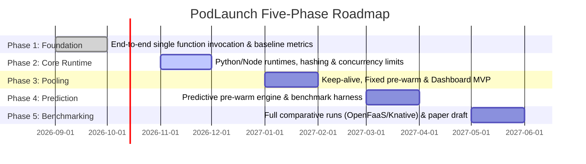

# PodLaunch

[](#project-status--roadmap)
[](https://www.python.org/)
[](#)

> **PodLaunch** is a lightweight, self-managed serverless function execution platform focused on **cold-start optimization**. Users deploy standalone functions rather than whole applications, while PodLaunch automatically packages them into isolated container images and manages on-demand container lifecycles on a local development machine without external cloud dependencies.

---

## 1. Problem Statement: The Cold-Start Dilemma

In serverless Function-as-a-Service (FaaS) architectures, functions scale to zero when idle to conserve system memory and compute. When an invocation arrives for an uninstantiated function:
- **Cold Start (100s of ms to seconds):** The platform must allocate resources, initialize container runtimes, pull/mount images, and load application code.
- **Warm Start (single-digit ms):** An existing, pre-warmed container handles the invocation immediately with minimal overhead.

For bursty or latency-sensitive workloads, cold starts introduce severe latency spikes (p99 tail latency). Existing platforms either impose high baseline memory overhead to keep containers alive or rely on complex external cloud services. PodLaunch addresses this tradeoff by evaluating, implementing, and benchmarking four distinct container-pooling strategies within a self-contained local environment.

---

## 2. Research Goals & Target Contribution

The primary research deliverable of PodLaunch is a rigorously measured comparison of four container pooling policies under realistic traffic profiles (steady, bursty/Poisson, and periodic):

> **Target Research Hypothesis:**  
> *"Under bursty traffic, predictive pre-warming reduced cold starts by **X%** and p99 latency by **Y ms** versus naive keep-alive, at **Z%** additional idle memory overhead."*

PodLaunch will validate these outcomes against baseline implementations and comparative local deployments of **OpenFaaS** and **Knative**.

### The Four Pooling Strategies
1. **Naive (Baseline):** Creates a fresh container on every request (`acquire`) and destroys it immediately upon completion (`release`). Serves as the ground-truth baseline for cold-start latency.
2. **Keep-Alive:** Retains containers after execution with an idle Time-To-Live (TTL) timer. Subsequent requests within the TTL window reuse the container. A background reaper expires stale containers.
3. **Fixed Pre-Warm:** Maintains a fixed pool of $N$ idle containers per function using a watermark-based replenishment mechanism (topping up when idle count falls below $N$).
4. **Predictive Pre-Warm:** Leverages timestamped invocation history and seasonal moving averages (e.g., 5-minute time buckets across historical intervals) to proactively pre-warm containers ahead of anticipated load spikes.

---

## 3. Key Features

- **Automated Container Packaging:** Builds per-runtime container images (`python3.11`, `node18`) with separated dependency and code layers for rapid caching.
- **Content-Hash Versioning:** Functions are uniquely versioned by the SHA-256 hash of their code and configuration, eliminating duplicate image builds.
- **Modular Scheduler & Concurrency Control:** Enforces per-function concurrency limits with an in-memory asynchronous FIFO queue.
- **Strict Sandbox Execution:** Runs functions in restricted Docker containers with strict memory limits, CPU quotas, PID limits, execution timeouts, and disabled network access.
- **Zero-Hot-Path Metrics:** Asynchronous metric collection recording correlation IDs, startup times, execution times, queue wait times, and memory consumption.
- **Deterministic Workload Generator & Benchmark Harness:** Replays reproducible Poisson, steady, and periodic traffic traces with k6 integration.
- **Zero Cloud Cost:** Entirely self-contained for local execution on developer workstations using Docker and PostgreSQL.

---

## 4. High-Level Architecture

```mermaid
flowchart TD
    Client["Client / Load Generator"] -->|POST /invoke/{function_name}| API["1. Invocation API (FastAPI)"]
    
    subgraph Control_Plane ["Control Plane & Orchestration"]
        API -->|Validate & Resolve Version| Registry[("1. Function Registry (PostgreSQL)")]
        API -->|Enqueue ExecutionRequest| Scheduler["2. Scheduler & Queue (FIFO)"]
        Scheduler -->|acquire(function_name)| PoolMgr["3. Container Pool Manager"]
    end

    subgraph Execution_Layer ["Execution Sandbox"]
        PoolMgr -->|create / execute / destroy| Sandbox["4. Execution Sandbox (Docker Engine)"]
        Sandbox -->|Run Container (CPU/Mem limits, no net)| Container[("User Function Container")]
    end

    Sandbox -->|ExecutionResult| PoolMgr
    PoolMgr -->|release(container)| PoolMgr
    PoolMgr -->|Return Container Result| Scheduler
    Scheduler -->|Format Response| API
    API -->|Response Envelope| Client

    subgraph Observability_Layer ["Async Observability & UI"]
        API -.->|Async Event| Metrics["5. Metrics & Benchmark Engine"]
        Scheduler -.->|Async Event| Metrics
        Sandbox -.->|Async Event| Metrics
        Metrics -->|Persist Logs| DB[("PostgreSQL")]
        Metrics -->|Prometheus Metrics| Dashboard["6. React Dashboard"]
    end
```

---

## 5. Technology Stack

| Layer / Component | Technology / Tools |
| :--- | :--- |
| **API & Registry** | Python 3.11, FastAPI, Pydantic v2, PostgreSQL, SQLAlchemy (asyncio), Alembic, docker-py, Uvicorn |
| **Scheduler & Queue** | Python 3.11, asyncio (in-memory FIFO), Pydantic |
| **Pool Manager (Research Core)** | Python 3.11, asyncio, docker-py, PostgreSQL (historical time-series logs) |
| **Execution Sandbox** | Docker Engine API, docker-py, Linux cgroups/namespaces |
| **Metrics & Benchmarking** | Python 3.11, structlog, Prometheus format, k6, NumPy/SciPy (percentile estimators) |
| **Dashboard** | React, Vite, Tailwind CSS / Vanilla CSS, Chart.js / Recharts |
| **Testing & Quality** | pytest, pytest-asyncio, httpx, Ruff / Black |

---

## 6. Full-Stack Monorepo Structure

```text
PodLaunch/
├── backend/                 # Python 3.11 + FastAPI Control Plane & Execution Engine
│   ├── app/
│   │   ├── main.py          # FastAPI application & CORS setup
│   │   ├── core/config.py   # Settings & PostgreSQL connection parameters
│   │   ├── contracts/       # Pydantic v2 typed data contracts (Schemas & Errors)
│   │   ├── db/              # SQLAlchemy async engine & PostgreSQL ORM models
│   │   ├── services/
│   │   │   ├── pool/        # Research Core: Strategy Engine & Pool Manager
│   │   │   │   ├── pool_manager.py
│   │   │   │   └── strategies/ # Naive, Keep-Alive, Fixed Pre-Warm, Predictive
│   │   │   ├── sandbox/     # Docker execution engine & cgroups limits
│   │   │   ├── scheduler/   # Async FIFO request queue & concurrency semaphores
│   │   │   ├── registry/    # Function packaging & SHA-256 versioning
│   │   │   └── metrics/     # Async telemetry collector & statistics
│   │   └── api/v1/          # REST API endpoints (/functions, /invoke, /pool, /telemetry)
│   ├── Dockerfile           # Backend containerization
│   ├── requirements.txt     # Python dependencies
│   └── README.md            # Backend developer guide
├── frontend/                # React + Vite Real-Time Telemetry & Execution Console
│   ├── src/
│   │   ├── App.jsx          # Root view state & navigation
│   │   ├── components/      # Dashboard, DeployModal, InvokeModal, Navbar, Footer
│   │   ├── data/            # Seed data & strategy metadata
│   │   └── index.css        # Neo-brutalist styling system
│   ├── index.html
│   ├── package.json
│   └── vite.config.js
├── docker-compose.yml       # Full-stack composition (Postgres + Backend + Frontend)
├── ARCHITECTURE.md          # Technical specifications, contracts & state machines
├── CONTEXT.md               # IDE & AI Assistant context guidelines
└── README.md                # Project overview & documentation entry point
```

---

## 7. Quick-Start Guide

### Option A: Complete Full-Stack with Docker Compose (Recommended)
```bash
docker compose up --build
```
- **React Frontend Console:** [http://localhost:5173](http://localhost:5173)
- **FastAPI Backend Docs:** [http://localhost:8000/api/v1/docs](http://localhost:8000/api/v1/docs)

### Option B: Local Development

#### 1. Backend (Python 3.11 + FastAPI)
```bash
cd backend
python -m venv .venv
source .venv/bin/activate    # On Windows: .venv\Scripts\activate
pip install -r requirements.txt
uvicorn app.main:app --reload --port 8000
```

#### 2. Frontend (React + Vite)
```bash
cd frontend
npm install
npm run dev
```

---

## 8. Team & Component Ownership

**Group-22 | VIT Bhopal University**  
*Degree:* B.E. Computer Science and Engineering (Specialization in Cloud Computing & Automation)  
*Faculty Supervisors:* **Dr. Virendra Singh Kushwah**, **Dr. Vijay Birchha**

| Name | Role / Component | Primary Responsibilities |
| :--- | :--- | :--- |
| **Aman Pal** | **Function Registry & Invocation API** | Packaging pipeline, Dockerfile templating, metadata DB, FastAPI invocation entry point. |
| **Aryan Arora** | **Scheduler & Queue** | Request queuing, concurrency limits, timeout handling, dispatching to Pool Manager. |
| **Tanishk Tiwari** | **Container Pool Manager *(Research Core)*** | 4 pooling strategies, `acquire`/`release` lifecycle, container TTL reaper, predictive pre-warming. |
| **Harsh Aggarwal** | **Execution Sandbox** | Docker execution boundary, CPU/memory limits, non-privileged isolation, error taxonomy. |
| **Rhythm Dhangar** | **Metrics, Benchmarking & Dashboard** | Workload generator (Poisson/bursty), k6 harnesses, async telemetry, React visualization UI. |

---

## 9. Project Status & Roadmap



- **Phase 1 (Months 1–2) — Foundation:** One function invocable end-to-end; baseline cold-start recorded; contracts finalized. *(Current Milestone: Capstone Review 1)*
- **Phase 2 (Months 3–4) — Core Runtime:** Python 3.11 + Node 18 runtime support, SHA-256 versioning, concurrency limits, persistent invocation timestamp logging.
- **Phase 3 (Months 5–6) — Pooling:** Keep-alive + fixed pre-warm implementations; cold-start rate reduction below baseline; React Dashboard MVP; Capstone Review 2 demo.
- **Phase 4 (Months 7–8) — Prediction:** Predictive pre-warming model using time-series history; benchmark harness completion.
- **Phase 5 (Months 9–10) — Benchmarking & Evaluation:** 4-strategy evaluation, comparative benchmarks against local OpenFaaS and Knative; final research report and paper draft.

---

## 10. Security & Isolation Disclaimer

> [!WARNING]
> **Academic Prototype Notice:**  
> PodLaunch utilizes standard Docker containers with resource constraints (cgroups, dropped capabilities, non-privileged execution, and disabled networking) as a **defense-in-depth isolation boundary suitable for a research prototype**.  
> Standard Docker containers share the host Linux kernel and do **not** constitute a production-grade multi-tenant security sandbox (such as AWS Firecracker microVMs or gVisor runtimes). PodLaunch is intended strictly for controlled benchmarking and trusted research environments.
